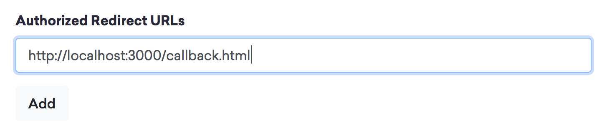
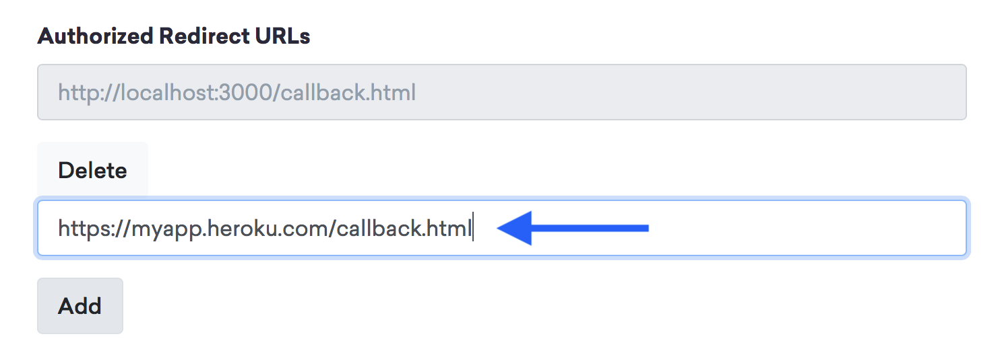

# Bitski Dapp Quickstart

This is a quick starting point for a web dapp built using Truffle and the Bitski SDK. The front-end is powered by plain javascript using webpack, and can easily be swapped out. This project is also configured to be easily deployed to Heroku.

## Prerequisites

- NPM
- Node
- [Truffle Framework](https://truffleframework.com) `npm install -g truffle`
- [Heroku CLI](https://devcenter.heroku.com/articles/heroku-cli) if you want to deploy to Heroku

## Setup

The easiest way to get started is to use our truffle box:

```
mkdir ProjectName
cd ProjectName
truffle unbox BitskiCo/quickstart
```

Alternatively, you can just clone this repo and run:

```
npm install
```

## Project structure

Path | Description
----- | -------
app/ | example javascript front-end app that demonstrates Bitski sign in, web3 usage, and importing contracts.
build/ | the compiled json metadata for your contracts (generated from `truffle migrate`).
contracts/ | Solidity contracts for your dapp.
migrations/ | Truffle migrations for your dapp. See `2_deploy_contracts.js` for an example of deploying a contract.
public/ | static files to be served from your app's root.
test/ | truffle tests
package.json | metadata about this project. customize with your details.
bitski.config.js | bitski configuration. update with your app's client id, and app wallet info.

## Creating your Client ID

You'll need a Bitski client id to run this app. Your client id provides some basic information to users about your application, and links various permissions granted by the user to your app.

Visit Bitski's [Developer Portal](https://developer.bitski.com), create an account if you haven't already, and create a new app. You can find your client ID under the "OAuth" section on your app details page.


Then you'll also want to add a redirect URL for localhost, where we'll be running the app locally: `http://localhost:3000/public/callback.html`



## Developing locally

This example uses webpack to combine some simple static files and plain javascript. Locally we'll use webpack-dev-server to serve the app.

#### Step 1: Edit your config

First, open `bitski.config.js` and paste your client id (from the developer portal):

```javascript
// bitski.config.js
…
app: {
  id: 'YOUR APP ID HERE'
}
…
```

#### Step 2: Start the development blockchain

Then, start Truffle's development blockchain:

```
truffle develop
```

If it's your first run, you'll also need to run the migrations. If you haven't already, make sure you have bitski-truffle-provider installed:

```
npm install --save-dev bitski-truffle-provider
```

From the truffle console you can just type `migrate`:
```
truffle> migrate
```

Or outside the console, just run:
```
truffle migrate
```

#### Step 3: Start the web server

Then, in a new terminal window, run the development web server:

```
npm run dev
```

Visit http://localhost:3000 to run the app. If everything is set up correctly, you should be able to log in to the dapp and see your wallet address. While in development mode, changes you make to the app will automatically trigger a reload of the page.

---

## Customizing the Dapp

Getting the example code working is just the beginning. Now it's up to your imagination to bring this dapp to life.

Start by designing your contract using Solidity. You'll put any contracts you write or reference in the /contracts folder. We've created a placeholder contract `MyContract.sol` that you can modify, or simply create a new .sol file.

- [Truffle Tutorials](https://truffleframework.com/tutorials)
- [Solidity Documentation](http://solidity.readthedocs.io/en/v0.4.24/)

Then, you'll want to write some simple tests to make sure your contract logic works as expected. Those go under the /tests folder. You can test them by running `truffle test`.

- [Truffle Docs: Testing](https://truffleframework.com/docs/getting_started/testing)

Once your contract is looking good, you'll want to get it built and deployed. You'll need to write migrations to deploy each of your contracts to the blockchain. See `migrations/2_deploy_contracts.js` for a very simple example. These migration files are run when you call `truffle migrate`.

- [Truffle Docs: Migrations](https://truffleframework.com/docs/getting_started/migrations)

Now that your contract is deployed, you should have a json file representing the contract you wrote in /build/contracts. You can use that file to call methods on your contract. See `app/app.js` and `app/contract.js` for example usage.

- [Web3's Contract documentation](https://web3js.readthedocs.io/en/1.0/web3-eth-contract.html#methods-mymethod-call)

---

## Deploying to a public server using Heroku

This template is designed to be easy to deploy on Heroku for live demos. The server is powered by `server.js`, a simple Express app that routes the files created by webpack.

#### Step 1: Deploy your contract with Truffle & Bitski App Wallet

First, since this will be a publicly accessible app you'll need to deploy your contract to a public blockchain.

In order to deploy your contract using Bitski, you'll need to have set up an app wallet. If you haven't already set one up, visit the [Developer Portal](https://developer.bitski.com) and create one by creating a new app. Make sure to select **Backend / App Wallet** as the app type, then paste your _client id_ and _client secret_ under _appWallet_ in `bitski.config.js`.

To get your app wallet's address, run `npm run get-address`.

Next, decide if you're going to use a test network (kovan or rinkeby) where ETH can be acquired for free, or live network where you'll have to pay with real ETH.

**Note:** Currently only `rinkeby` and `live` are supported by Bitski's App Wallet.

Make sure you add some ETH to your wallet to pay the transaction fees to deploy your contract. How much you need depends on how complex your contract is, but a good place to start is 0.1 or 0.2 ETH.

If you're deploying on a test net, you can get ETH from a <a href="https://faucet.rinkeby.io" target="_blank">faucet</a>, otherwise buy some ETH from <a href="https://coinbase.com" target="_blank">Coinbase</a>.

Finally, run the migrate command with the desired network value (live, kovan, or rinkeby):

```
truffle migrate --network live
```

If you don't want to use Bitski to deploy, you can also use a more complicated setup with an HDWallet and Infura. [Learn more here](https://truffleframework.com/tutorials/using-infura-custom-provider).

#### Step 2: Deploy your front-end app on Heroku

Make sure you have a Heroku account, and have installed heroku-cli. Then, create your heroku app using heroku-cli:

```
heroku apps:create my-app-name
```

Heroku will create a new project with the name you specified and will output your new URL in the console.

Now that you have a dedicated URL for your app, update your redirect url in the [developer portal](https://developer.bitski.com) to include your callback route on the new domain (https://my-app.herokuapp.com/callback.html).



Then, make sure your `bitski.config.js` production environment is configured correctly:

- Add your new url to `environments.production.redirectURL` (making sure to include /callback.html)
- Make sure `environments.production.network` matches where your contract was deployed

Commit your changes:

```
git add .
git commit -m "Made some changes"
```

Then, push to Heroku:

```
git push heroku master
```

Finally, check out your live site!

```
heroku open
```

#### Updating your app

Whenever you want to update the front-end application, simply commit your changes and push to heroku again.

```
git push heroku master
```
